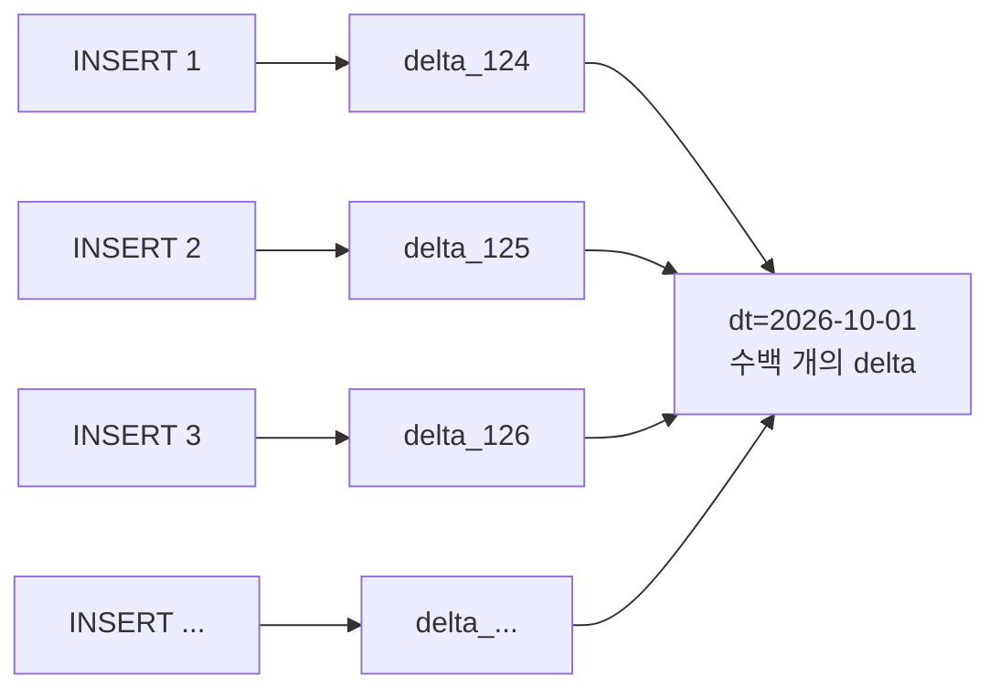
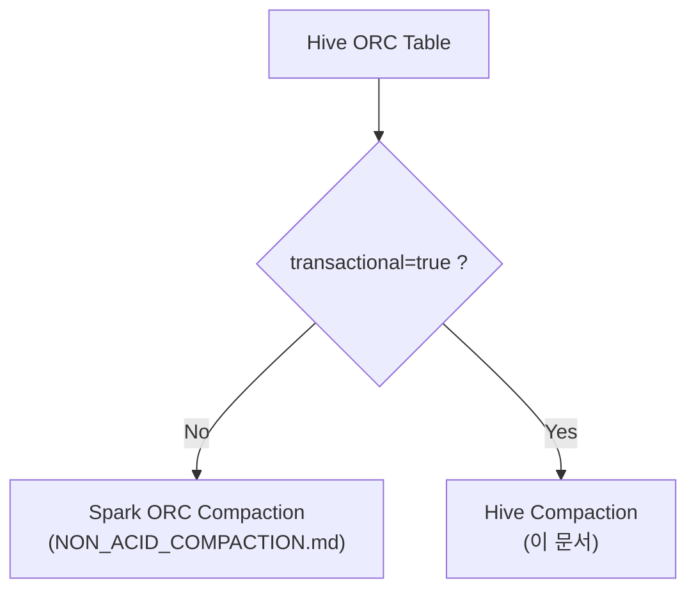
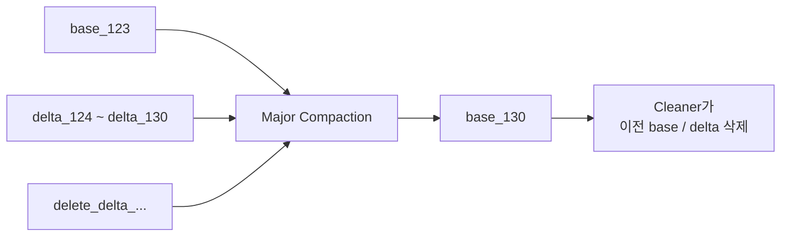
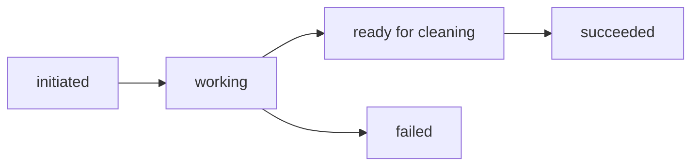
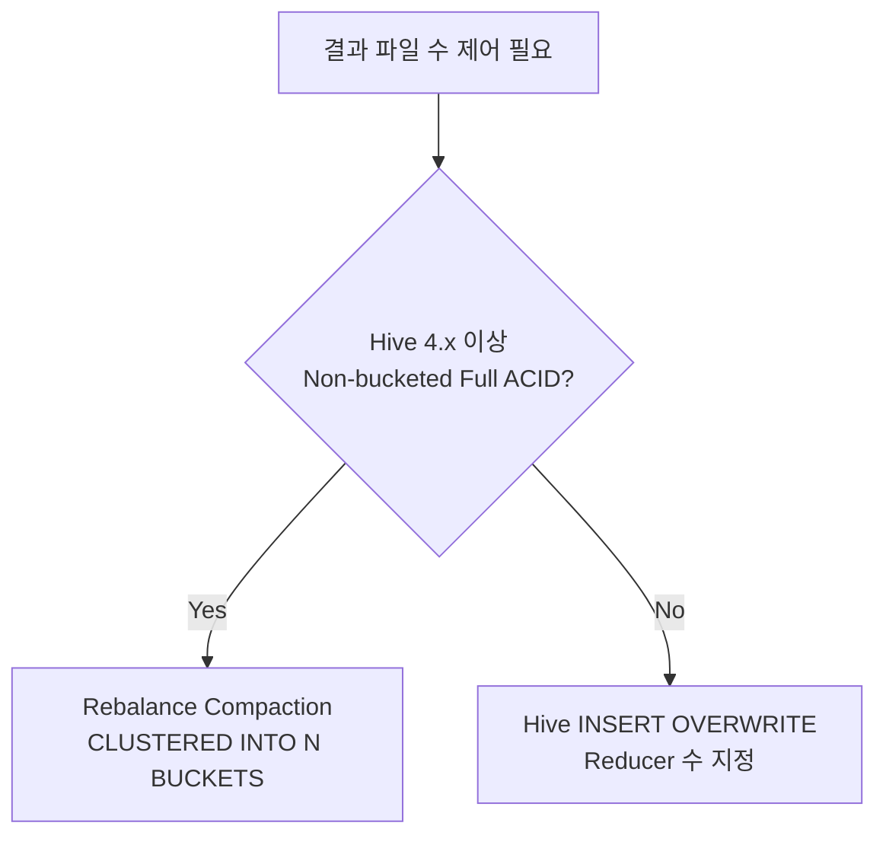
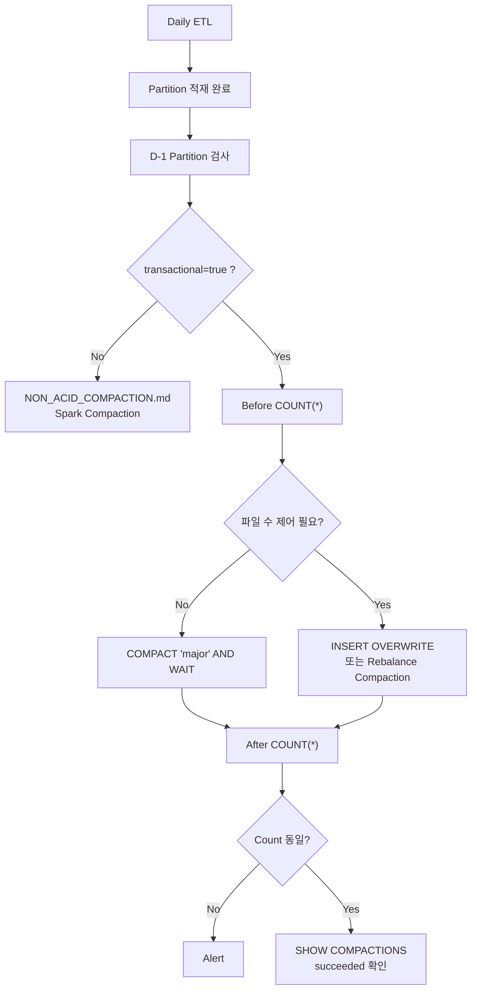

# ACID Hive ORC Table Small File Compaction (Hive)

> **적용 대상: Hive ACID(Transactional) ORC 테이블 전용**
>
> `transactional`=`true`인 테이블은 Spark로 직접 파일을 병합하면 안 됩니다.
> Non-ACID 테이블은 [Non-ACID 테이블 Compaction 가이드](NON_ACID_COMPACTION.md)를 참고하십시오.
>
> 목록으로 돌아가기: [README](README.md)

## 1. ACID 테이블 판별

다음 중 하나라도 해당되면 Hive ACID 테이블입니다.

### 1.1 테이블 속성

```sql
SHOW TBLPROPERTIES dw.sales('transactional');
```

결과가 `true`이면 ACID 테이블입니다.

```sql
SHOW TBLPROPERTIES dw.sales('transactional_properties');
```

| `transactional_properties` | 의미 |
| --- | --- |
| 없음 또는 `default` | Full ACID (INSERT / UPDATE / DELETE / MERGE) |
| `insert_only` | Insert-only ACID (MM 테이블) |

HDP 3.x / CDP처럼 Managed Table이 기본적으로 ACID로 생성되는 환경에서는 별도로 지정하지 않아도 ACID 테이블일 수 있습니다.

### 1.2 HDFS 디렉터리 구조

Partition 경로에 다음과 같은 디렉터리가 있다면 ACID 테이블입니다.

```text
/warehouse/tablespace/managed/hive/dw.db/sales/dt=2026-10-01/
├── base_0000123/
│   ├── bucket_00000
│   ├── bucket_00001
│   └── ...
├── delta_0000124_0000124_0000/
│   └── bucket_00000
├── delta_0000125_0000125_0000/
│   └── bucket_00000
└── delete_delta_0000126_0000126_0000/
    └── bucket_00000
```

| 디렉터리 / 파일 | 의미 |
| --- | --- |
| `base_N` | Major Compaction 또는 `INSERT OVERWRITE` 결과 |
| `delta_N_M_S` | `INSERT` / `UPDATE` 1회마다 생성되는 변경분 |
| `delete_delta_N_M_S` | `UPDATE` / `DELETE`로 삭제된 Row 정보 |
| `bucket_NNNNN` | ACID 데이터 파일. `CLUSTERED BY`가 없는 테이블에도 이 이름이 사용됩니다. |

반복 `INSERT`마다 `delta_*` 디렉터리가 하나씩 쌓이는 것이 ACID 테이블에서 Small File이 생기는 원인입니다.



---

## 2. Spark로 병합하면 안 되는 이유

* Spark는 Hive Warehouse Connector(HWC) 없이 `base` / `delta` / `delete_delta`를 병합하여 읽지 못하므로, Row Count와 데이터가 틀리거나 읽기 자체가 실패할 수 있습니다.
* Spark로 `INSERT OVERWRITE`하면 Hive의 Transaction 메타데이터(Write ID)와 실제 파일이 어긋날 수 있습니다.
* [Non-ACID 가이드](NON_ACID_COMPACTION.md)의 PySpark 프로그램은 `transactional`=`true`이면 실행을 중단합니다.

따라서 ACID 테이블은 **Hive 자체 기능**으로 Compaction합니다.



---

## 3. Minor / Major Compaction

| 종류 | 동작 | 결과 |
| --- | --- | --- |
| Minor | 여러 `delta`를 하나의 `delta`로, 여러 `delete_delta`를 하나의 `delete_delta`로 병합 | `delta_124_130` |
| Major | `base` + 모든 `delta` + `delete_delta`를 하나의 새로운 `base`로 재작성 | `base_130` |

Small File 정리가 목적이라면 **Major Compaction**을 사용합니다.



---

## 4. Major Compaction 실행

beeline에서 실행합니다.

```sql
-- 1. ACID 여부 확인
SHOW TBLPROPERTIES dw.sales('transactional');

-- 2. Partition 단위로 Major Compaction 요청
ALTER TABLE dw.sales
PARTITION (dt='2026-10-01')
COMPACT 'major';

-- 3. 진행 상태 확인
SHOW COMPACTIONS;
```

`ALTER TABLE ... COMPACT`는 요청을 Queue에 등록만 하고 바로 반환합니다. 완료될 때까지 기다리려면 `AND WAIT`을 붙입니다.

```sql
ALTER TABLE dw.sales
PARTITION (dt='2026-10-01')
COMPACT 'major' AND WAIT;
```

`SHOW COMPACTIONS`의 상태는 다음 순서로 변합니다.



| 상태 | 의미 |
| --- | --- |
| `initiated` | Queue에 등록됨 |
| `working` | Compactor Worker가 처리 중 |
| `ready for cleaning` | 새로운 `base` 생성 완료, 이전 디렉터리 삭제 대기 |
| `succeeded` | Cleaner가 이전 디렉터리 삭제 완료 |
| `failed` | 실패. Metastore / HiveServer2 로그 확인 필요 |

이전 `base` / `delta` 디렉터리는 해당 디렉터리를 읽고 있는 쿼리가 모두 종료된 이후에 Cleaner가 삭제하므로, Compaction 직후에는 HDFS에 남아 있을 수 있습니다.

Compaction이 `initiated` 상태에서 진행되지 않는다면 Hive Metastore의 다음 설정을 확인합니다.

| 설정 | 필요한 값 |
| --- | --- |
| `hive.compactor.initiator.on` | `true` |
| `hive.compactor.worker.threads` | 1 이상 |

---

## 5. 결과 파일 개수 / 크기 제어

`COMPACT 'major'` 자체에는 결과 파일 개수나 크기를 지정하는 옵션이 없습니다.

Major Compaction 이후 `base_N` 안의 파일 수는 다음과 같이 결정됩니다.

| 테이블 유형 | Major Compaction 이후 파일 수 |
| --- | --- |
| Bucketed ACID (`CLUSTERED BY ... INTO N BUCKETS`) | **N개 고정** (Bucket당 1개) |
| Non-bucketed ACID | 입력 데이터에 존재하는 **Bucket ID 종류 수** (최초 적재 시 Writer Task 수로 결정) |

`orc.stripe.size` 등 ORC 설정은 파일 내부 Stripe 크기에만 영향을 주며 파일 개수나 크기를 결정하지 않습니다.

파일 개수 또는 크기를 직접 제어하려면 다음 방법 중 하나를 사용합니다.



### 5.1 방법 1: Rebalance Compaction (Hive 4.x)

Hive 4.0부터 Non-bucketed Full ACID 테이블은 결과 Bucket(파일) 수를 지정하여 Compaction할 수 있습니다.

```sql
ALTER TABLE dw.sales
PARTITION (dt='2026-10-01')
COMPACT 'rebalance'
CLUSTERED INTO 8 BUCKETS;
```

* Query-based Compaction이 활성화되어 있어야 합니다.
* Bucketed 테이블과 Insert-only 테이블에는 사용할 수 없습니다.
* Hive 3.x / HDP 3.x에는 이 구문이 없으며, CDP는 배포 버전에 따라 지원 여부가 다릅니다.
* 사용 전 `SELECT version();`으로 Hive 버전을 확인하고, 사용하는 배포판 문서에서 구문을 확인하십시오.

### 5.2 방법 2: Hive INSERT OVERWRITE (권장, 버전 무관)

Hive(beeline)에서 같은 Partition을 다시 작성합니다. 결과 파일 수는 Reducer 수와 같으므로 정확하게 제어할 수 있습니다.

목표 파일 수는 다음처럼 계산합니다.

```text
Target Files
=
ceil(
    Partition Size
    /
    Target File Size
)
```

예: Partition Size가 4 GB이고 Target File Size가 512 MB라면 `4 × 1024 / 512 = 8`이므로 8개입니다.

Partition 크기는 다음처럼 확인할 수 있습니다.

```bash
hdfs dfs -du -s -h /warehouse/tablespace/managed/hive/dw.db/sales/dt=2026-10-01
```

#### 파일 개수 고정

```sql
SET hive.tez.auto.reducer.parallelism=false;
SET mapreduce.job.reduces=8;

INSERT OVERWRITE TABLE dw.sales
PARTITION (dt='2026-10-01')
SELECT
    id,
    customer_id,
    amount
FROM dw.sales
WHERE dt='2026-10-01'
DISTRIBUTE BY pmod(hash(id), 8);
```

| 설정 | 역할 |
| --- | --- |
| `hive.tez.auto.reducer.parallelism=false` | Tez가 Reducer 수를 자동으로 줄이지 않도록 고정 |
| `mapreduce.job.reduces=8` | Reducer 수 = 결과 파일 수 |
| `DISTRIBUTE BY pmod(hash(id), 8)` | 8개 Reducer에 Row를 고르게 분배 |

`DISTRIBUTE BY rand()`는 사용하지 마십시오. Task가 재시도되면 Row가 중복되거나 누락될 수 있습니다. 분배 Key는 값이 고르게 분포된 컬럼(예: PK)을 사용합니다.

#### 크기 기준

```sql
SET hive.exec.reducers.bytes.per.reducer=536870912;  -- 512 MB
```

이 값은 **입력** 데이터 크기를 기준으로 Reducer 수를 추정하므로 결과 파일 크기는 근사치입니다. 정확한 개수가 필요하다면 파일 개수 고정 방식을 사용합니다.

#### 주의 사항

* ACID 테이블은 Snapshot Isolation을 지원하므로 같은 Partition을 읽으면서 Overwrite할 수 있습니다. 결과로 새로운 `base_N`이 생성되고 이전 `delta`는 Cleaner가 정리합니다.
* 실행 중 Partition에 Exclusive Lock이 걸리므로 **적재가 완료된 Partition**(일반적으로 D-1 이전)에만 실행합니다.
* `SELECT` 컬럼 목록은 테이블의 Partition Column을 제외한 모든 컬럼을 정의 순서대로 지정해야 합니다.

---

## 6. Row Count 검증

Compaction 또는 `INSERT OVERWRITE` 전후로 건수를 비교합니다.

```sql
-- 실행 전
SELECT COUNT(*) FROM dw.sales WHERE dt='2026-10-01';

-- Compaction / INSERT OVERWRITE 실행

-- 실행 후
SELECT COUNT(*) FROM dw.sales WHERE dt='2026-10-01';
```

`hive.compute.query.using.stats=true`이면 `COUNT(*)`가 실제 데이터 대신 Metastore 통계로 응답될 수 있으므로 검증 시에는 해제합니다.

```sql
SET hive.compute.query.using.stats=false;
```

결과 파일 수는 HDFS에서 확인합니다.

```bash
hdfs dfs -ls -R /warehouse/tablespace/managed/hive/dw.db/sales/dt=2026-10-01
```

---

## 7. 자동 Compaction 기준

Hive Metastore의 Initiator가 다음 기준에 따라 Compaction을 자동으로 요청합니다. 이 설정은 결과 파일 크기가 아니라 **언제** Compaction을 시작할지를 결정합니다.

| 설정 | 의미 | 기본값 |
| --- | --- | --- |
| `hive.compactor.delta.num.threshold` | `delta` 디렉터리 수가 이 값을 넘으면 Minor Compaction | 10 |
| `hive.compactor.delta.pct.threshold` | `delta` 크기가 `base` 대비 이 비율을 넘으면 Major Compaction | 0.1 |
| `hive.compactor.check.interval` | Initiator가 Compaction 대상을 확인하는 주기 | 300s |

테이블 단위로 자동 Compaction을 끄려면:

```sql
ALTER TABLE dw.sales SET TBLPROPERTIES ('no_auto_compaction'='true');
```

---

## 8. Small File 예방

Compaction보다 Small File이 덜 생기도록 적재 방식을 조정하는 것이 효과적입니다.

* 작은 `INSERT`를 여러 번 수행하지 말고 가능한 한 한 번에 모아서 적재합니다.
* `INSERT INTO ... VALUES`를 반복 실행하지 않습니다. 실행할 때마다 `delta`가 하나씩 생성됩니다.
* 적재가 끝난 Partition은 정기적으로 Major Compaction을 수행합니다.

---

## 9. 운영 흐름



---

## 10. 권장 운영 값

| 항목 | 권장 |
| --- | --- |
| Compaction 단위 | Hive Partition |
| 기본 방법 | `COMPACT 'major'` |
| 파일 수 제어 | Hive `INSERT OVERWRITE` + Reducer 수 지정 (Hive 4.x는 Rebalance Compaction) |
| 목표 파일 크기 | 256 MB ~ 512 MB |
| 대상 | 적재 완료 Partition (D-1 이전) |
| 검증 | 전후 `COUNT(*)` (`hive.compute.query.using.stats=false`) |
| Spark 직접 병합 | 사용 금지 |
