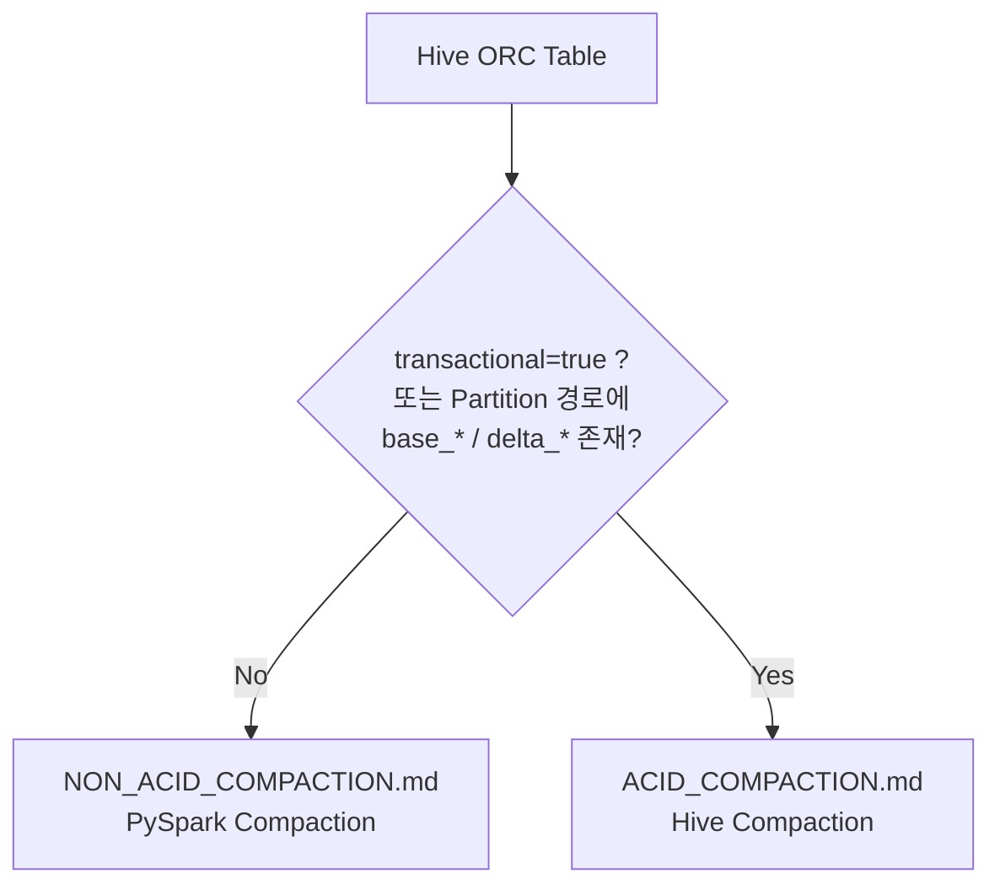

# Hive ORC Table Small File Compaction

Hive ORC 테이블에 반복적으로 `INSERT`가 수행되면 하나의 Partition 아래에 많은 작은 파일이 생성됩니다.
이 저장소는 테이블 유형에 따라 Small File을 적절한 크기의 ORC 파일로 재구성하는 방법을 설명합니다.

## 문서

| 문서 | 대상 테이블 | 방법 |
| --- | --- | --- |
| [Non-ACID 테이블 Compaction](NON_ACID_COMPACTION.md) | `transactional` 속성이 없거나 `false`인 일반 Hive ORC 테이블 | PySpark로 Staging ORC 생성 후 `INSERT OVERWRITE` |
| [ACID 테이블 Compaction](ACID_COMPACTION.md) | `transactional`=`true`인 Hive ACID 테이블 | Hive Major Compaction / Hive `INSERT OVERWRITE` |

## 어떤 문서를 봐야 하나요?



테이블 유형은 다음처럼 확인합니다.

```sql
SHOW TBLPROPERTIES dw.sales('transactional');
```

```bash
hdfs dfs -ls <partition 경로>
```

| 확인 결과 | 테이블 유형 |
| --- | --- |
| `transactional`=`true` | ACID |
| Partition 경로에 `base_*`, `delta_*`, `delete_delta_*` 디렉터리 존재 | ACID |
| 데이터 파일 이름이 `bucket_00000` 형태 | ACID |
| 위 항목에 해당하지 않고 `000000_0` 등 파일이 Partition 경로에 바로 존재 | Non-ACID |

> **주의:** ACID 테이블에는 Non-ACID용 PySpark 프로그램을 사용하지 마십시오. Spark는 Hive Warehouse Connector 없이 ACID 테이블을 올바르게 읽거나 쓸 수 없습니다.
