# Hive ORC Small File Merge with PySpark

## 1. 목적

Hive ORC 테이블에 반복적으로 `INSERT`가 수행되면 하나의 Hive Partition 아래에 많은 작은 ORC 파일이 생성될 수 있습니다.

예:

```text
dt=2026-10-01

2 MB
3 MB
1 MB
4 MB
2 MB
...
1,000 files
```

이러한 Small File을 Spark를 이용하여 다음처럼 병합합니다.

```text
Before

1,000 Small ORC Files

        ↓

After

6 ~ 20 Large ORC Files
```

목표는 단순히 파일을 하나로 합치는 것이 아니라 적절한 크기의 ORC 파일로 재구성하는 것입니다.

권장 시작값:

```text
Target ORC File Size

256 MB ~ 512 MB
```

---

# 2. 전체 처리 구조

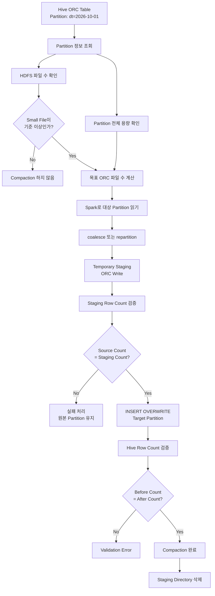

---

# 3. 처리 전 데이터 구조

예를 들어 Hive 테이블이 다음과 같다고 가정합니다.

```sql
CREATE TABLE dw.sales (
    id          BIGINT,
    customer_id STRING,
    amount      DECIMAL(18,2)
)
PARTITIONED BY (
    dt STRING
)
STORED AS ORC;
```

HDFS에는 다음처럼 저장되어 있을 수 있습니다.

```text
/user/hive/warehouse/dw.db/sales/

├── dt=2026-09-29
├── dt=2026-09-30
└── dt=2026-10-01
      ├── 000000_0.orc
      ├── 000001_0.orc
      ├── 000002_0.orc
      ├── 000003_0.orc
      ├── ...
      └── 000999_0.orc
```

이를 Mermaid로 표현하면 다음과 같습니다.

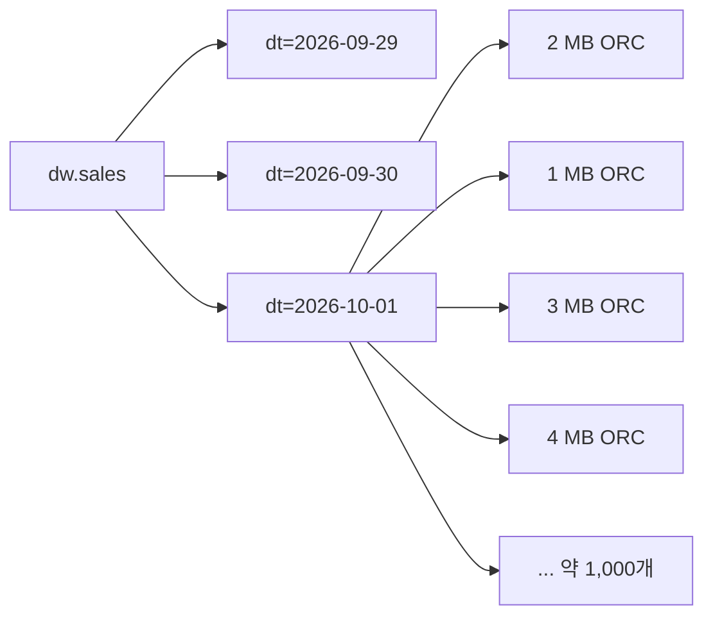

---

# 4. Merge 이후

예를 들어 파티션 전체 데이터 크기가 5GB이고 목표 파일 크기를 512MB로 설정한다면:

```text
5GB / 512MB
≈ 10 files
```

정도로 재구성할 수 있습니다.

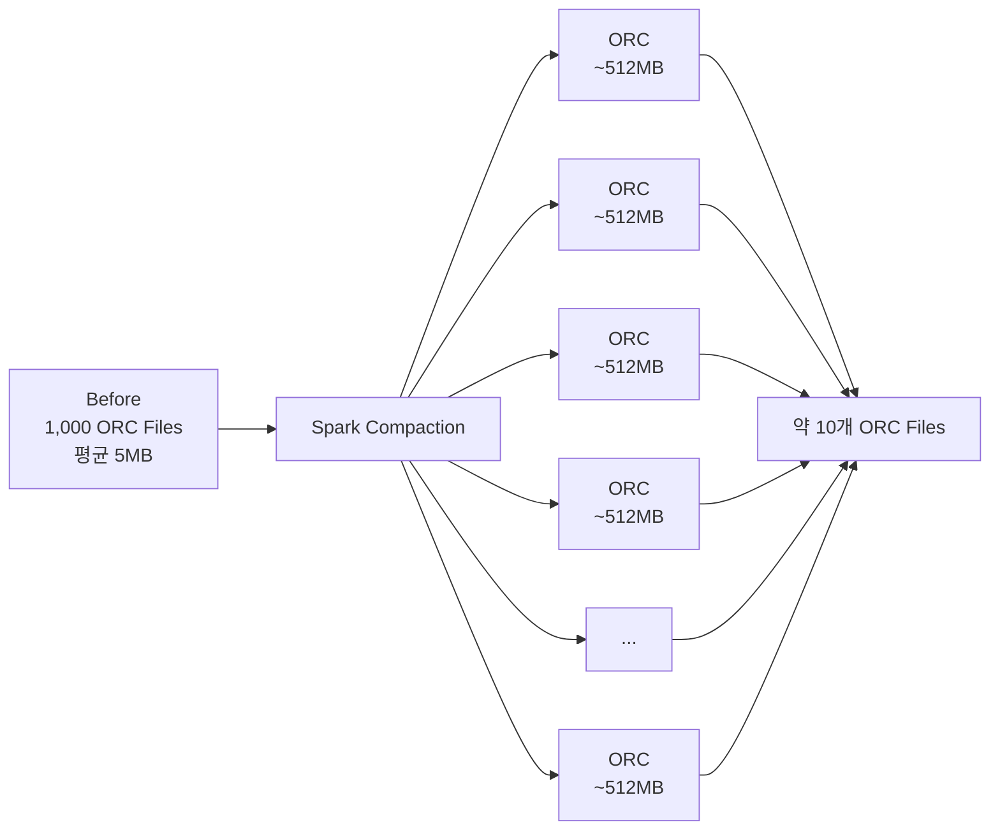

---

# 5. 원본에 바로 Overwrite하면 안 되는 이유

다음 구조는 피하는 것이 좋습니다.

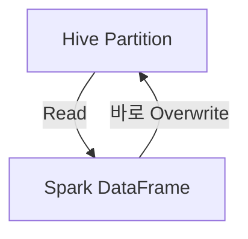

Spark가 읽고 있는 디렉터리를 동시에 삭제하거나 Overwrite할 수 있기 때문입니다.

따라서 Staging Area를 사용합니다.

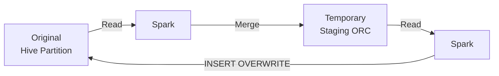

이것이 이번 PySpark 프로그램의 핵심 구조입니다.

---

# 6. 파일 개수 자동 계산

운영 환경에서는 다음처럼 고정하는 것보다:

```python
target_files = 4
```

파티션 크기로 계산하는 것을 권장합니다.

계산식은 다음과 같습니다.

```text
Target Files
=
ceil(
    Partition Size
    /
    Target File Size
)
```

예:

```text
Partition Size = 10 GB

Target File Size = 512 MB
```

이면:

```text
10 × 1024 / 512
=
20
```

따라서:

```text
Target Files = 20
```

입니다.

---

# 7. Compaction 판단

다음과 같은 정책을 사용할 수 있습니다.

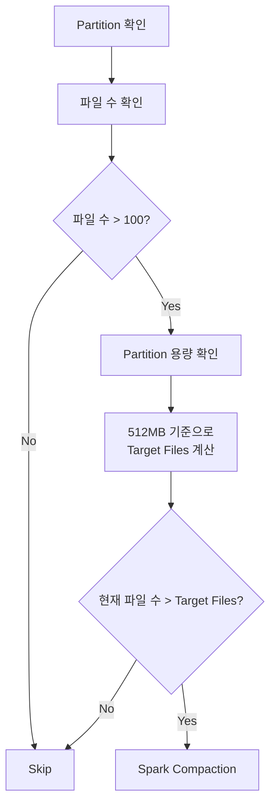

예를 들어:

```text
현재 파일

1,027 files

Partition Size

10 GB

Target Size

512 MB

Target Files

20
```

이라면:

```text
1,027 → 약 20 files
```

로 Merge합니다.

---

# 8. PySpark 전체 프로그램

다음 코드는 다음 기능을 포함합니다.

* Hive Partition 위치 자동 조회
* HDFS Partition 용량 확인
* HDFS 파일 수 확인
* 목표 ORC 파일 수 자동 계산
* Small File 기준 이하이면 Skip
* `coalesce()` 또는 `repartition()` 지원
* Staging ORC 생성
* Source/Staging Row Count 검증
* `INSERT OVERWRITE PARTITION`
* 최종 Row Count 검증
* 성공 시 Staging 삭제
* ACID Table 방어
* Hive Bucket Table 방어

파일 이름:

```text
hive_orc_compaction.py
```

```python
#!/usr/bin/env python3

import argparse
import math
import re
import uuid
from datetime import datetime

from pyspark.sql import SparkSession


# ============================================================
# Spark Session
# ============================================================

spark = (
    SparkSession.builder
    .appName("HiveORCPartitionCompaction")
    .enableHiveSupport()
    .getOrCreate()
)


# ============================================================
# Utility
# ============================================================

def sql_quote(value):
    """
    SQL 문자열에서 single quote escape
    """
    return str(value).replace("'", "''")


def parse_partition_args(partition_args):
    """
    다음 형식을 Dictionary로 변환한다.

    --partition dt=2026-10-01

    또는

    --partition year=2026
    --partition month=10
    --partition day=01
    """

    result = {}

    for item in partition_args:

        if "=" not in item:
            raise ValueError(
                f"잘못된 partition 형식: {item}"
            )

        key, value = item.split("=", 1)

        key = key.strip()
        value = value.strip()

        if not key:
            raise ValueError(
                f"Partition column이 비어 있습니다: {item}"
            )

        result[key] = value

    return result


def make_partition_sql(partition_spec):
    """
    Hive PARTITION SQL 생성

    {
        "dt": "2026-10-01"
    }

    →

    `dt`='2026-10-01'
    """

    result = []

    for key, value in partition_spec.items():

        result.append(
            f"`{key}`='{sql_quote(value)}'"
        )

    return ", ".join(result)


def make_where_sql(partition_spec):
    """
    WHERE 조건 생성
    """

    result = []

    for key, value in partition_spec.items():

        result.append(
            f"`{key}`='{sql_quote(value)}'"
        )

    return " AND ".join(result)


# ============================================================
# Table Safety Check
# ============================================================

def validate_table(table_name):
    """
    Spark 방식으로 처리하면 안 되는 테이블을 사전에 확인한다.

    1. Hive ACID
    2. Hive Bucketed Table
    """

    rows = spark.sql(
        f"SHOW CREATE TABLE {table_name}"
    ).collect()

    ddl = "\n".join(
        str(row[0])
        for row in rows
    )

    print()
    print("========================================")
    print("Table Validation")
    print("========================================")

    # Bucket Table 확인

    if re.search(
        r"\bCLUSTERED\s+BY\b",
        ddl,
        re.IGNORECASE
    ):
        raise RuntimeError(
            "Hive Bucketed Table입니다. "
            "CLUSTERED BY 테이블에는 "
            "이 Compaction 프로그램을 사용하지 마십시오."
        )

    # Hive ACID 확인

    if re.search(
        r"""['"]transactional['"]\s*=\s*['"]true['"]""",
        ddl,
        re.IGNORECASE
    ):
        raise RuntimeError(
            "Hive ACID Transactional Table입니다. "
            "Spark Merge 대신 Hive MAJOR COMPACTION을 "
            "사용하는 것을 권장합니다."
        )

    print("Table validation OK")


# ============================================================
# Partition Location
# ============================================================

def get_partition_location(
    table_name,
    partition_spec
):
    """
    Hive Metastore에서 Partition의 실제 HDFS Location을 조회한다.
    """

    partition_sql = make_partition_sql(
        partition_spec
    )

    query = f"""
        DESCRIBE FORMATTED {table_name}
        PARTITION ({partition_sql})
    """

    rows = spark.sql(query).collect()

    for row in rows:

        key = (
            str(row[0]).strip()
            if row[0] is not None
            else ""
        )

        if key == "Location":

            return str(row[1]).strip()

    raise RuntimeError(
        "Partition Location을 찾을 수 없습니다."
    )


# ============================================================
# HDFS Information
# ============================================================

def get_hdfs_statistics(path_string):
    """
    Hadoop FileSystem API를 이용하여

    - 전체 용량
    - 파일 수

    를 조회한다.
    """

    jvm = spark.sparkContext._jvm

    hadoop_conf = (
        spark.sparkContext
        ._jsc
        .hadoopConfiguration()
    )

    Path = jvm.org.apache.hadoop.fs.Path

    path = Path(path_string)

    fs = path.getFileSystem(
        hadoop_conf
    )

    if not fs.exists(path):

        raise RuntimeError(
            f"HDFS Path가 존재하지 않습니다: "
            f"{path_string}"
        )

    summary = fs.getContentSummary(
        path
    )

    return {
        "bytes": summary.getLength(),
        "files": summary.getFileCount()
    }


def delete_hdfs_path(path_string):
    """
    Staging HDFS directory 삭제
    """

    jvm = spark.sparkContext._jvm

    hadoop_conf = (
        spark.sparkContext
        ._jsc
        .hadoopConfiguration()
    )

    Path = jvm.org.apache.hadoop.fs.Path

    path = Path(path_string)

    fs = path.getFileSystem(
        hadoop_conf
    )

    if fs.exists(path):

        fs.delete(
            path,
            True
        )


# ============================================================
# Target File Calculation
# ============================================================

def calculate_target_files(
    partition_size_bytes,
    target_file_size_mb
):

    target_bytes = (
        target_file_size_mb
        * 1024
        * 1024
    )

    target_files = math.ceil(
        partition_size_bytes
        / target_bytes
    )

    return max(
        1,
        target_files
    )


# ============================================================
# Human Readable Size
# ============================================================

def human_size(size):

    units = [
        "B",
        "KB",
        "MB",
        "GB",
        "TB"
    ]

    value = float(size)

    for unit in units:

        if value < 1024:
            return (
                f"{value:.2f} {unit}"
            )

        value /= 1024

    return (
        f"{value:.2f} PB"
    )


# ============================================================
# Main Compaction
# ============================================================

def compact_partition(
    table_name,
    partition_spec,
    staging_base,
    target_file_size_mb=512,
    min_file_count=100,
    target_files_override=None,
    merge_mode="coalesce",
    keep_staging=False
):

    print()
    print("========================================")
    print("Hive ORC Partition Compaction")
    print("========================================")

    print(
        "Table          :",
        table_name
    )

    print(
        "Partition      :",
        partition_spec
    )

    # --------------------------------------------------------
    # 1. Table 검증
    # --------------------------------------------------------

    validate_table(
        table_name
    )

    # --------------------------------------------------------
    # 2. Partition Location 조회
    # --------------------------------------------------------

    partition_location = (
        get_partition_location(
            table_name,
            partition_spec
        )
    )

    print(
        "Location       :",
        partition_location
    )

    # --------------------------------------------------------
    # 3. HDFS 통계
    # --------------------------------------------------------

    stats = get_hdfs_statistics(
        partition_location
    )

    partition_size = stats["bytes"]
    current_files = stats["files"]

    print(
        "Partition Size :",
        human_size(partition_size)
    )

    print(
        "Current Files  :",
        current_files
    )

    # --------------------------------------------------------
    # 4. Compaction 필요 여부
    # --------------------------------------------------------

    if current_files < min_file_count:

        print()
        print(
            f"현재 파일 수가 "
            f"{min_file_count}개 미만입니다."
        )

        print(
            "Compaction을 수행하지 않습니다."
        )

        return

    # --------------------------------------------------------
    # 5. Target File 개수 계산
    # --------------------------------------------------------

    if target_files_override:

        target_files = (
            target_files_override
        )

    else:

        target_files = (
            calculate_target_files(
                partition_size,
                target_file_size_mb
            )
        )

    print(
        "Target Size    :",
        f"{target_file_size_mb} MB"
    )

    print(
        "Target Files   :",
        target_files
    )

    if current_files <= target_files:

        print()
        print(
            "현재 파일 수가 Target File 수보다 "
            "작거나 같습니다."
        )

        print(
            "Compaction을 수행하지 않습니다."
        )

        return

    # --------------------------------------------------------
    # 6. Column 정보
    # --------------------------------------------------------

    table_df = spark.table(
        table_name
    )

    all_columns = (
        table_df.columns
    )

    partition_columns = (
        list(
            partition_spec.keys()
        )
    )

    data_columns = [
        column
        for column in all_columns
        if column not in partition_columns
    ]

    # --------------------------------------------------------
    # 7. 대상 Partition 읽기
    # --------------------------------------------------------

    where_sql = make_where_sql(
        partition_spec
    )

    source_df = spark.sql(
        f"""
        SELECT *
        FROM {table_name}
        WHERE {where_sql}
        """
    )

    print()
    print(
        "Source Row Count 확인..."
    )

    source_count = (
        source_df.count()
    )

    print(
        "Source Rows     :",
        source_count
    )

    if source_count == 0:

        print(
            "Partition 데이터가 없습니다."
        )

        return

    # --------------------------------------------------------
    # 8. Spark Partition 조절
    # --------------------------------------------------------

    if merge_mode == "repartition":

        merged_df = (
            source_df
            .repartition(
                target_files
            )
        )

    else:

        merged_df = (
            source_df
            .coalesce(
                target_files
            )
        )

    # --------------------------------------------------------
    # 9. Staging Path 생성
    # --------------------------------------------------------

    run_id = (
        datetime.now()
        .strftime(
            "%Y%m%d_%H%M%S"
        )
        +
        "_"
        +
        uuid.uuid4().hex[:8]
    )

    safe_table = (
        table_name
        .replace(".", "_")
    )

    staging_path = (
        staging_base.rstrip("/")
        +
        "/"
        +
        safe_table
        +
        "/"
        +
        run_id
    )

    print(
        "Staging Path   :",
        staging_path
    )

    # --------------------------------------------------------
    # 10. Staging ORC Write
    # --------------------------------------------------------

    print()
    print(
        "Staging ORC Write 시작..."
    )

    (
        merged_df
        .write
        .mode("overwrite")
        .format("orc")
        .save(
            staging_path
        )
    )

    print(
        "Staging ORC Write 완료."
    )

    # --------------------------------------------------------
    # 11. Staging 데이터 검증
    # --------------------------------------------------------

    staged_df = (
        spark.read
        .format("orc")
        .load(
            staging_path
        )
    )

    staged_count = (
        staged_df.count()
    )

    print()
    print(
        "Source Rows     :",
        source_count
    )

    print(
        "Staging Rows    :",
        staged_count
    )

    if source_count != staged_count:

        raise RuntimeError(
            "Source와 Staging Row Count가 "
            "일치하지 않습니다. "
            "원본 Partition은 변경하지 않습니다."
        )

    print(
        "Staging Validation OK"
    )

    # --------------------------------------------------------
    # 12. Temporary View
    # --------------------------------------------------------

    temp_view = (
        "compact_"
        +
        uuid.uuid4().hex
    )

    staged_df.createOrReplaceTempView(
        temp_view
    )

    # --------------------------------------------------------
    # 13. INSERT OVERWRITE SQL
    # --------------------------------------------------------

    select_columns = ", ".join(
        f"`{column}`"
        for column in data_columns
    )

    partition_sql = (
        make_partition_sql(
            partition_spec
        )
    )

    overwrite_sql = f"""
        INSERT OVERWRITE TABLE {table_name}
        PARTITION ({partition_sql})

        SELECT
            {select_columns}

        FROM {temp_view}
    """

    print()
    print("========================================")
    print("INSERT OVERWRITE")
    print("========================================")

    print(
        overwrite_sql
    )

    # --------------------------------------------------------
    # 14. Partition 교체
    # --------------------------------------------------------

    spark.sql(
        overwrite_sql
    )

    print(
        "INSERT OVERWRITE 완료."
    )

    # --------------------------------------------------------
    # 15. 최종 Count 검증
    # --------------------------------------------------------

    target_count = (
        spark.sql(
            f"""
            SELECT COUNT(*) AS cnt
            FROM {table_name}
            WHERE {where_sql}
            """
        )
        .first()["cnt"]
    )

    print()
    print("========================================")
    print("Validation")
    print("========================================")

    print(
        "Before Rows :",
        source_count
    )

    print(
        "After Rows  :",
        target_count
    )

    if source_count != target_count:

        raise RuntimeError(
            "Compaction 이후 Row Count가 "
            "일치하지 않습니다."
        )

    print(
        "Row Count Validation OK"
    )

    # --------------------------------------------------------
    # 16. 결과 HDFS 파일 수 확인
    # --------------------------------------------------------

    after_stats = (
        get_hdfs_statistics(
            partition_location
        )
    )

    print()
    print("========================================")
    print("Compaction Result")
    print("========================================")

    print(
        "Before Files :",
        current_files
    )

    print(
        "After Files  :",
        after_stats["files"]
    )

    print(
        "Before Size  :",
        human_size(
            partition_size
        )
    )

    print(
        "After Size   :",
        human_size(
            after_stats["bytes"]
        )
    )

    # --------------------------------------------------------
    # 17. Temporary View 삭제
    # --------------------------------------------------------

    spark.catalog.dropTempView(
        temp_view
    )

    # --------------------------------------------------------
    # 18. Staging 삭제
    # --------------------------------------------------------

    if not keep_staging:

        print()
        print(
            "Staging Directory 삭제..."
        )

        delete_hdfs_path(
            staging_path
        )

        print(
            "Staging Directory 삭제 완료."
        )

    else:

        print(
            "Staging Directory 유지:",
            staging_path
        )

    print()
    print(
        "Compaction SUCCESS"
    )


# ============================================================
# Command Line
# ============================================================

def main():

    parser = argparse.ArgumentParser(
        description=(
            "Hive ORC Partition "
            "Small File Compaction"
        )
    )

    parser.add_argument(
        "--table",
        required=True,
        help="Hive table: db.table"
    )

    parser.add_argument(
        "--partition",
        action="append",
        required=True,
        help=(
            "Partition 조건. "
            "예: --partition dt=2026-10-01"
        )
    )

    parser.add_argument(
        "--staging-base",
        default=(
            "hdfs:///tmp/"
            "hive_orc_compaction"
        )
    )

    parser.add_argument(
        "--target-file-size-mb",
        type=int,
        default=512
    )

    parser.add_argument(
        "--min-file-count",
        type=int,
        default=100
    )

    parser.add_argument(
        "--target-files",
        type=int,
        default=None,
        help=(
            "자동 계산 대신 "
            "파일 개수 직접 지정"
        )
    )

    parser.add_argument(
        "--merge-mode",
        choices=[
            "coalesce",
            "repartition"
        ],
        default="coalesce"
    )

    parser.add_argument(
        "--keep-staging",
        action="store_true"
    )

    args = parser.parse_args()

    partition_spec = (
        parse_partition_args(
            args.partition
        )
    )

    compact_partition(
        table_name=args.table,
        partition_spec=partition_spec,
        staging_base=args.staging_base,
        target_file_size_mb=(
            args.target_file_size_mb
        ),
        min_file_count=(
            args.min_file_count
        ),
        target_files_override=(
            args.target_files
        ),
        merge_mode=(
            args.merge_mode
        ),
        keep_staging=(
            args.keep_staging
        )
    )


if __name__ == "__main__":
    main()
```

---

# 9. PySpark 프로그램 실행

파일을 다음 이름으로 저장합니다.

```text
hive_orc_compaction.py
```

그리고 `spark-submit`으로 실행합니다.

```bash
spark-submit \
  hive_orc_compaction.py \
  --table dw.sales \
  --partition dt=2026-10-01
```

기본 설정은 다음과 같습니다.

```text
Target File Size

512 MB


Minimum File Count

100


Merge Mode

coalesce
```

---

# 10. Target File Size 변경

256MB를 목표로 하고 싶다면:

```bash
spark-submit \
  hive_orc_compaction.py \
  --table dw.sales \
  --partition dt=2026-10-01 \
  --target-file-size-mb 256
```

---

# 11. 파일 개수를 직접 지정

자동 계산하지 않고 무조건 약 8개로 만들고 싶다면:

```bash
spark-submit \
  hive_orc_compaction.py \
  --table dw.sales \
  --partition dt=2026-10-01 \
  --target-files 8
```

이 경우:

```text
Target File Size
```

계산보다 `--target-files` 설정이 우선합니다.

---

# 12. 복수 Partition Column

테이블이:

```sql
PARTITIONED BY (
    year STRING,
    month STRING,
    day STRING
)
```

이라면 다음처럼 실행합니다.

```bash
spark-submit \
  hive_orc_compaction.py \
  --table dw.sales \
  --partition year=2026 \
  --partition month=10 \
  --partition day=01
```

대상은:

```text
year=2026/month=10/day=01
```

입니다.

---

# 13. coalesce와 repartition

기본값은:

```bash
--merge-mode coalesce
```

입니다.

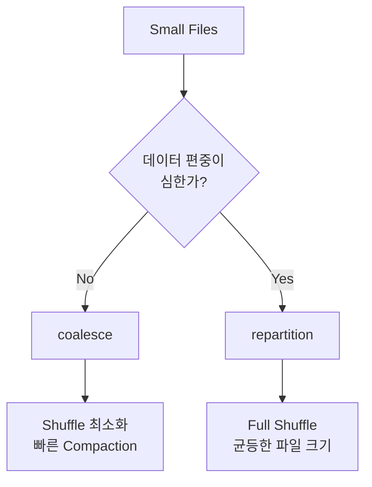

일반적인 Small File 처리라면:

```text
coalesce
```

부터 사용하는 것이 좋습니다.

파일 크기가 심하게 불균등한 경우:

```bash
--merge-mode repartition
```

을 사용할 수 있습니다.

예:

```bash
spark-submit \
  hive_orc_compaction.py \
  --table dw.sales \
  --partition dt=2026-10-01 \
  --merge-mode repartition
```

---

# 14. 실제 처리 예

처리 전:

```text
Table

dw.sales


Partition

dt=2026-10-01


Partition Size

9.7 GB


ORC Files

1,243
```

목표 파일 크기가:

```text
512MB
```

라면 프로그램은 대략 다음처럼 계산합니다.

```text
9.7 GB
÷
512 MB

≈

20 files
```

결과:

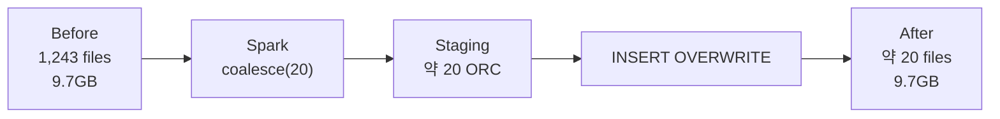

---

# 15. 운영 시점

현재 데이터가 계속 들어오고 있는 Partition은 Compaction하면 안 됩니다.

예를 들어 오늘이:

```text
2026-10-01
```

이고 현재 다음 파티션에 계속 데이터가 들어온다면:

```text
dt=2026-10-01
```

이를 동시에 Compaction하지 않는 것이 좋습니다.

권장 방식:

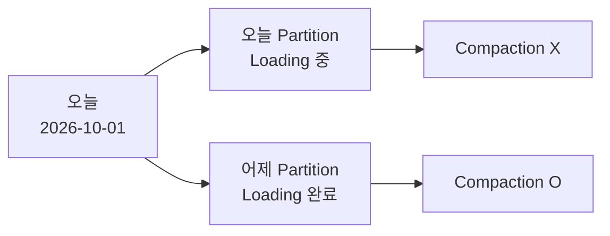

즉 일반적으로:

```text
D-1
```

이전의 **적재가 완전히 종료된 Partition만** 처리합니다.

---

# 16. Hive Bucket Table 주의

다음과 같은 테이블:

```sql
CLUSTERED BY (customer_id)
INTO 32 BUCKETS
```

은 단순한 Small File 문제가 아닙니다.

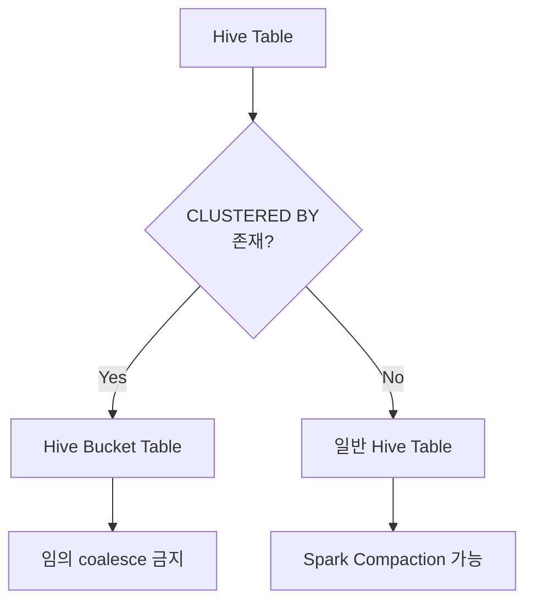

작성한 PySpark 프로그램은 `SHOW CREATE TABLE`을 검사하여 `CLUSTERED BY`가 발견되면 실행을 중단하도록 했습니다.

---

# 17. Hive ACID Table 주의

다음 속성이 있다면:

```sql
'transactional'='true'
```

Hive ACID Table입니다.

이 경우 Spark 방식보다 Hive Compaction을 사용하는 것이 좋습니다.

```sql
ALTER TABLE dw.sales
PARTITION (dt='2026-10-01')
COMPACT 'MAJOR';
```

구조적으로:

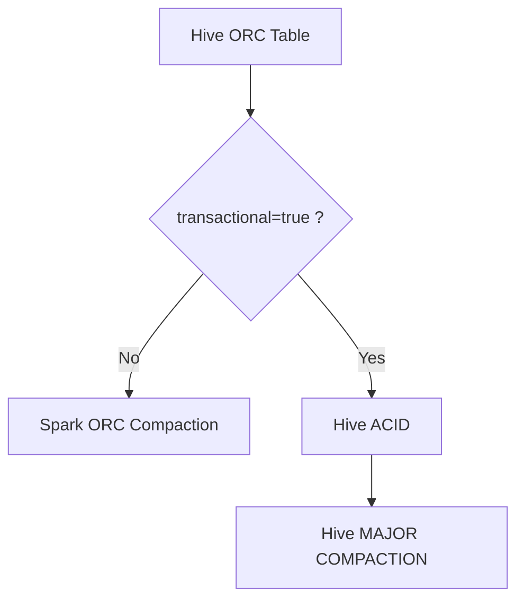

---

# 18. 운영 자동화 구조

최종적으로는 다음 형태로 운영하는 것을 권장합니다.

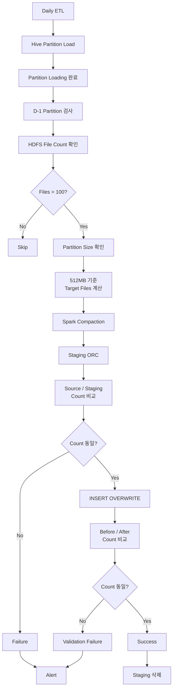

---

# 19. 권장 운영 값

초기 운영값으로 다음 정도를 권장합니다.

| 설정            |                권장 시작값 |
| ------------- | --------------------: |
| Compaction 단위 |        Hive Partition |
| 최소 파일 수       |                  100개 |
| 목표 ORC 크기     |                 512MB |
| 작은 Partition  |             최소 1 File |
| 기본 Merge 방식   |            `coalesce` |
| 데이터 편중        |         `repartition` |
| 대상            |       적재 완료 Partition |
| 일반적 대상 시점     |                D-1 이하 |
| 검증            |             Row Count |
| Staging       |            HDFS 별도 경로 |
| ACID          | Hive Major Compaction |
| Bucket Table  |                 별도 처리 |

---

# 20. 가장 중요한 처리 흐름

운영 관점에서 핵심만 정리하면 다음과 같습니다.


핵심 원칙은 다음입니다.

```text
원본 Partition
        ↓
Spark Read
        ↓
파일 개수 축소
        ↓
Staging ORC
        ↓
데이터 건수 검증
        ↓
INSERT OVERWRITE PARTITION
        ↓
다시 데이터 건수 검증
        ↓
Staging 삭제
```

특히 **원본 파티션을 읽으면서 같은 경로에 직접 overwrite하지 않는 것**과 **데이터가 계속 적재 중인 파티션을 Compaction하지 않는 것**이 가장 중요합니다.
